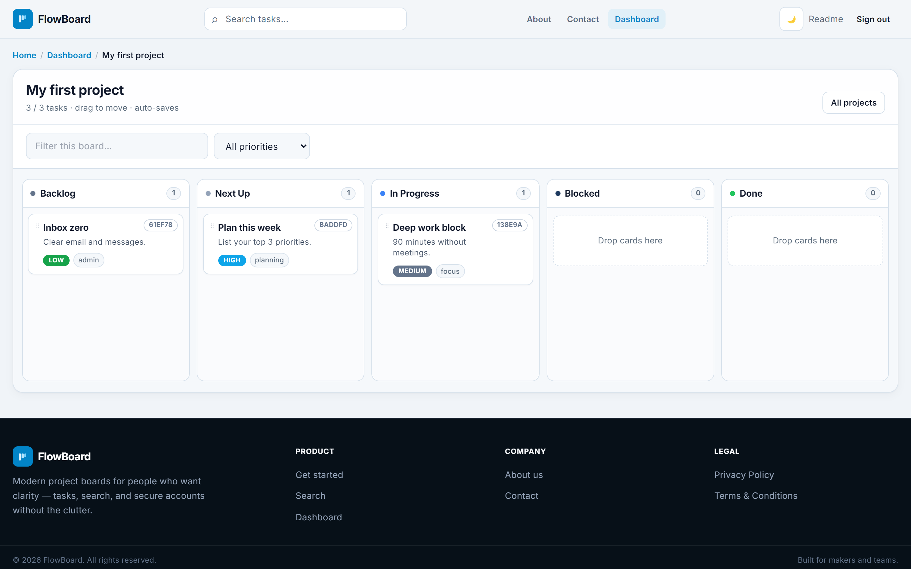
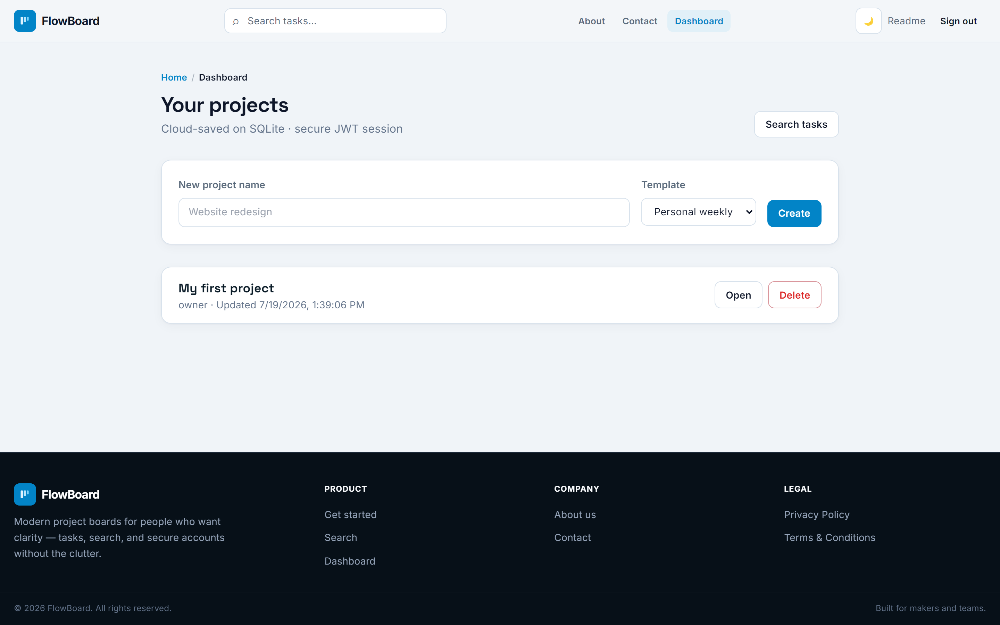
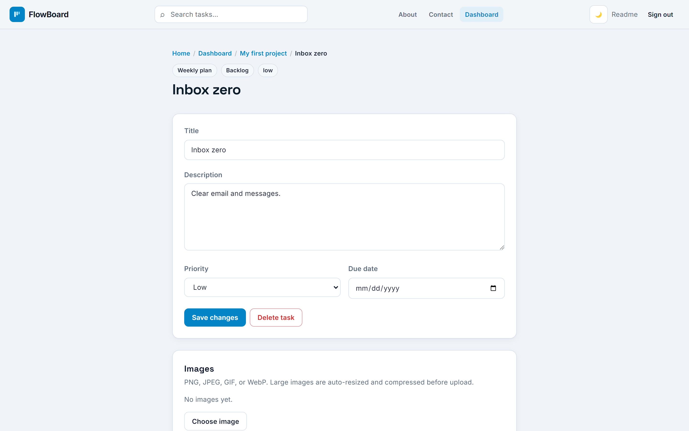
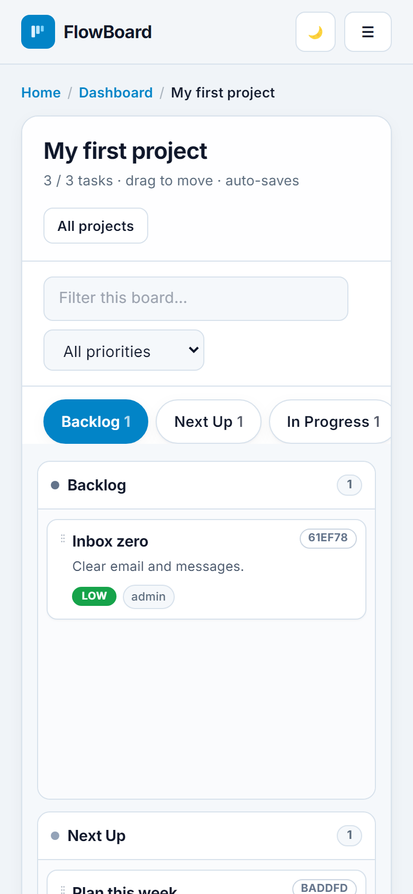

# FlowBoard

**Multi-user project kanban that ships to the edge** — accounts, drag-and-drop boards, search, images, and comments — live on Cloudflare Pages + D1.

**[Open live demo →](https://kanban-board-public.pages.dev)** · [Release notes v4.0.0](docs/releases/v4.0.0.md)

---

## Why FlowBoard

Create an account, get a project board instantly, drag tasks between columns, open any card for detail, checklist, images, and @mentions. Your board is just a URL — no desktop app, no fake demo data, no “deploy to Railway and pray.”

Built for makers and small teams who want clarity without the noise of heavyweight project tools.

---

## Screenshots

### Board (desktop)



### Landing


### Dashboard



### Task detail



### Mobile



---

## Features

| Area | What you get |
|------|----------------|
| **Accounts** | Register / login, JWT httpOnly cookies, multi-project ownership |
| **Kanban** | Drag cards, auto-save, board filters, solid priority pills, column counts |
| **Task detail** | Title, description, due date, checklist, comments |
| **Comments** | @name / @email mentions with autocomplete, #tags, up to 4 images per comment |
| **Images** | Attach to tasks (and comments); large screenshots auto-resize + compress before upload |
| **Search** | Global header search with live results; full search page |
| **Themes** | Light / dark mode (persisted), unified chrome + black footer |
| **Mobile** | Column tabs (no forced horizontal board scroll), thumb-friendly controls |
| **Security** | Same-origin CSRF guard, membership tenancy in SQL, secrets never in the browser |
| **Quality** | Production e2e suite (60+ checks) including real PNG upload round-trips |

---

## Stack

| Layer | Technology |
|-------|------------|
| Frontend | Vite · React 18 · TypeScript · Tailwind (layout) · design tokens · React Router |
| Backend | Cloudflare **Pages Functions** (edge) |
| Database | Cloudflare **D1** (SQLite) — users, boards, tasks, comments, image blobs |
| Auth | JWT (`fb_token` cookie) + **PBKDF2** via Web Crypto |
| Deploy | Type B direct upload: `wrangler pages deploy client/dist --branch main` |

`git push` updates the repo only — it does **not** deploy. Production is always a wrangler Pages deploy.

---

## Quick start (local)

```bash
npm install --prefix client
npm run build
# create .dev.vars with: JWT_SECRET=your-long-secret-at-least-32-chars
npx wrangler pages dev client/dist --d1=DB --compatibility-date=2026-07-01
```

## Deploy

```bash
npm run db:migrate
npx wrangler pages secret put JWT_SECRET --project-name kanban-board-public
npm run deploy
```

Requires `CLOUDFLARE_API_TOKEN` and `CLOUDFLARE_ACCOUNT_ID`.

## Tests

```bash
npm run test:e2e
# API_BASE=https://kanban-board-public.pages.dev node scripts/e2e-prod.mjs
```

---

## Project layout

```
client/          Vite React app (UI)
functions/       Pages Functions API (/api/*)
migrations/      D1 SQL migrations
scripts/         e2e + release helpers
docs/            releases + screenshots
```

## License / ops notes

- Set a strong production `JWT_SECRET` (32+ random chars).
- D1 image size is limited; the client compresses large uploads automatically.
- Optional Express tree under `server/` is **not** the production path.

---

**Production:** https://kanban-board-public.pages.dev  
**Tag:** `v4.0.0`
